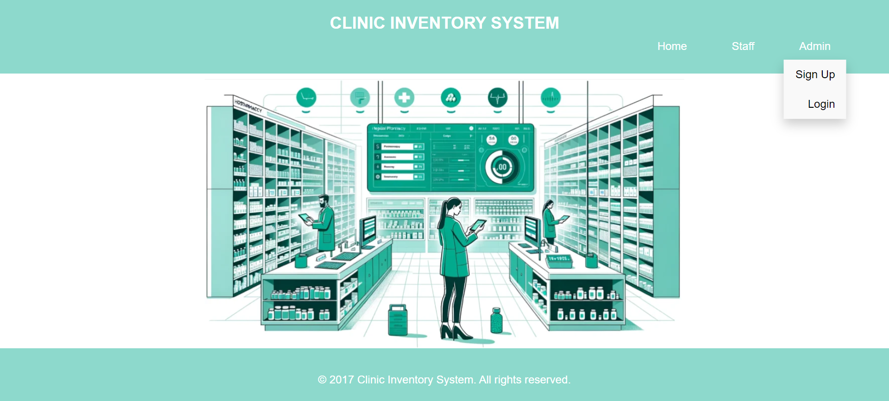
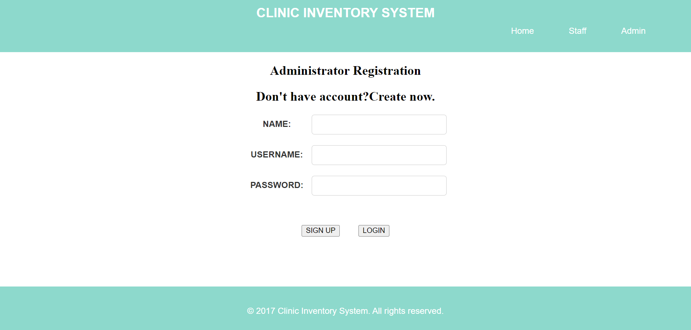
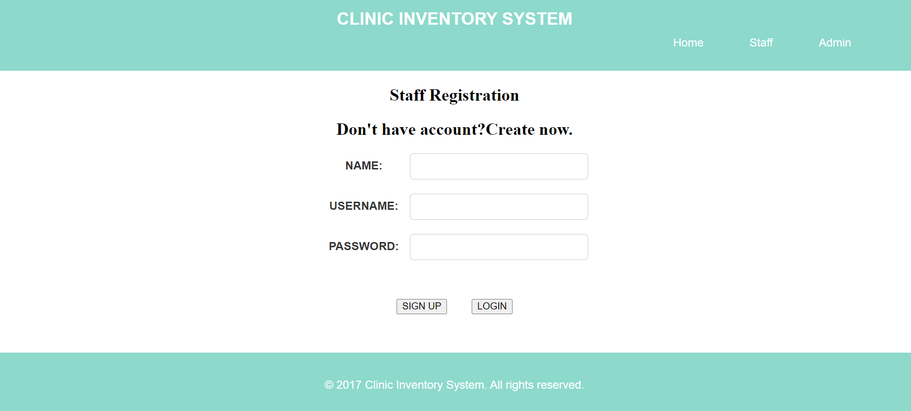
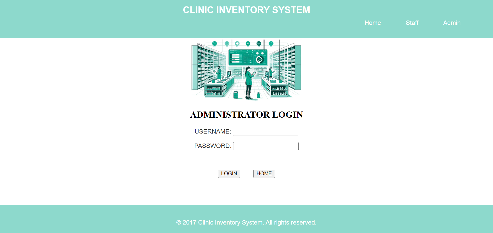
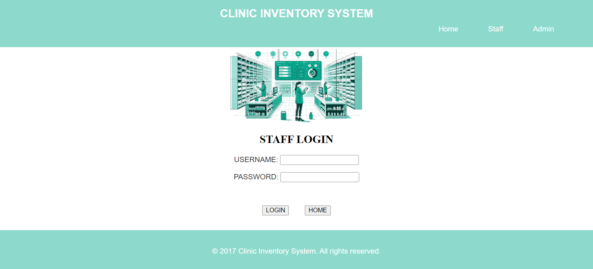
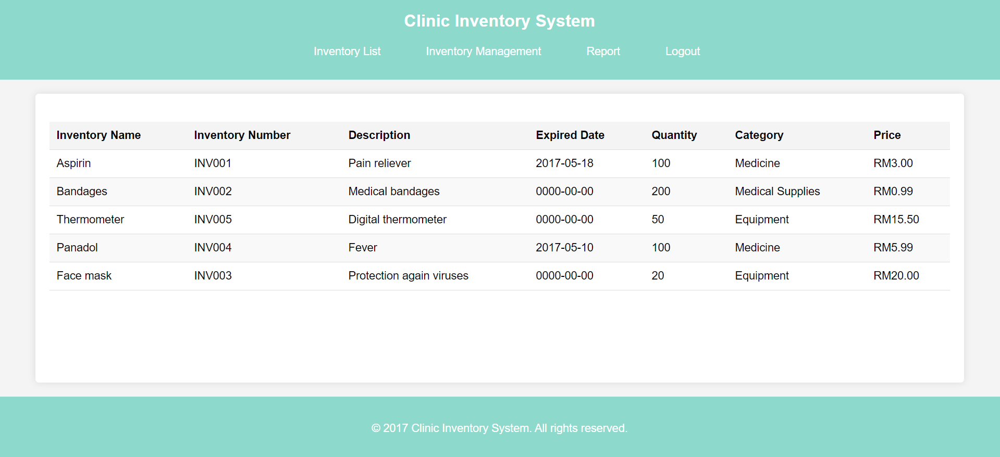
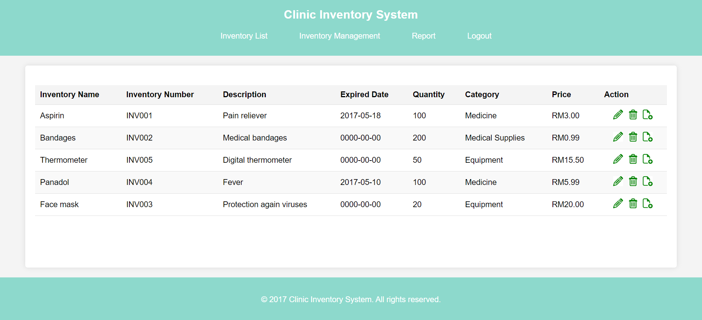
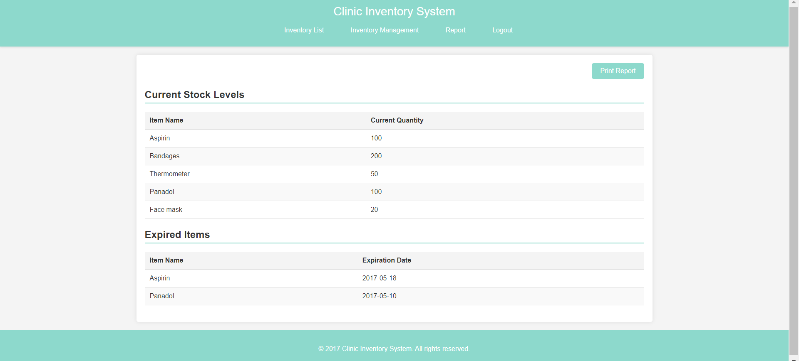

# Clinic Inventory Management System

## 🏥 Overview
This project is a Clinic Inventory Management System, a web application designed to streamline the management of inventory items in a clinic. It allows both admin and staff users to log in and access specific functionalities depending on their roles. Admin users can manage inventory and view reports, while staff members can view the inventory available at the clinic. The application utilizes **HTML**, **CSS** and JavaScript for the frontend, **PHP** for the backend and **MySQL** as the database. The entire application is developed within the **XAMPP** environment using **Visual Studio Code**.

---

## 📋 Features

### 🔑 User Authentication
- **Admin & Staff Login**: Separate login pages for both admin and staff users, ensuring secure access to the system.
- **Admin Registration**: Admins can register and log in to manage the entire inventory system.
- **Staff Registration**: Staff can register and log in to access inventory information.

### 👨‍💼 Admin Features
- **🔍 View All Inventory**: Admin can view a comprehensive list of all inventory items, eliminating the need for manual searches and ensuring ease of managing the items.
- **➕ Add New Inventory**: Easily add new items to the inventory with key details like name, inventory number, description, expiration date, category, quantity and price.
- **✏️ Update Existing Inventory**: Modify inventory item details such as stock levels, expiration dates and prices, to keep current information.
- **❌ Delete Inventory**: Remove outdated or expired items to maintain an accurate and clean inventory database.
- **📊  Generate Report**: Create detailed inventory reports, showing current stock levels and expired items.
- **🖨️Print Report**: Print or export report in PDF or CSV format for external use or auditing purposes.

### 👩‍⚕️👨‍⚕️ Staff Features
- **🔍 View All Inventory**: Staff can view a comprehensive list of all inventory items, eliminating the need for manual searches and ensuring quick access to information.

### 📝 User-Friendly Interface
- **Simple Registration and Login**: Both admins and staff can easily register and log in to the system.
- **Responsive Design**: The system is built with a responsive interface, ensuring that it works seamlessly on desktops.

---

## 🛠️ Technologies Used
- **🔧 Frontend**: HTML, CSS, JavaScript
- **🖥️ Backend**: PHP
- **💾 Database**: MySQL
- **💻 Development Environment**: XAMPP, Visual Studio Code

---

## 📷 Screenshot
1. **🏠 Home Page**: The main entry point for users, offering navigation options for both admin and staff. It ensures easy access to the application's features.

2. **📝 Registration Page**: New users can create their accounts by entering essential information such as username and password.
 
 

3. **🔑 Login Page**: Existing users can log in by providing their credentials.

4. **📋 Admin Inventory List Page**: Displays all inventory items within the clinic including details such as inventory name, inventory number, description, expiry date, quantity, category and price.
 

5. **🔧 Admin Inventory Management Page**: Allows admin users to view, add, update and delete inventory item information.

6. **📊 Admin Report Page**: Enables admin users to generate and view reports.
 

7. **📋 Staff Inventory List Page**: Staff members can view all available inventory items in the clinic, allowing quick access to information without manual searching for efficient operations.

